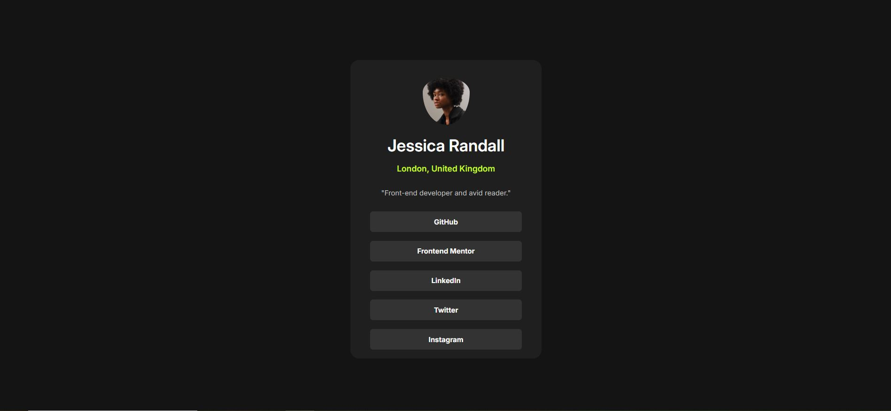

# Frontend Mentor - Social links profile solution

This is a solution to the [Social links profile challenge on Frontend Mentor](https://www.frontendmentor.io/challenges/social-links-profile-UG32l9m6dQ). Frontend Mentor challenges help you improve your coding skills by building realistic projects. 

## Table of contents

- [Overview](#overview)
  - [The challenge](#the-challenge)
  - [Screenshot](#screenshot)
  - [Links](#links)
- [My process](#my-process)
  - [Built with](#built-with)
  - [What I learned](#what-i-learned)
  - [Continued development](#continued-development)
  - [Useful resources](#useful-resources)
- [Author](#author)

## Overview

### The challenge

Users should be able to:

- See hover and focus states for all interactive elements on the page

### Screenshot

### Links

- Solution URL: [GitHub](https://github.com/abigailjulie/FontendMentor_SocialProfile)
- Live Site URL: [Vercel](https://fontendmentorsocialprofile.vercel.app/)

## My process

### Built with

- Semantic HTML5 markup
- CSS custom properties
- Flexbox
- CSS Grid
- Mobile-first workflow

### What I learned

I was able to exploring adding external links and using flexbox on links.

### Continued development

I would like more practice adding images to a documentand adjusting it's edges.

### Useful resources

- [MDN Links](https://developer.mozilla.org/en-US/docs/Web/HTML/Element/a) - Everythink you need to know about adding and external link

## Author

- Website - [Abigail Figaro](https://www.abigaildesigns.org)
- Frontend Mentor - [@abigailjulie](https://www.frontendmentor.io/profile/abigailjulie)